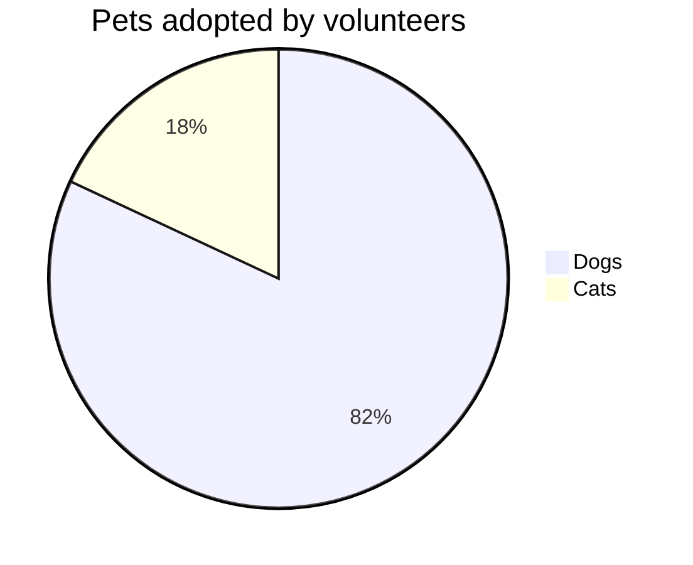
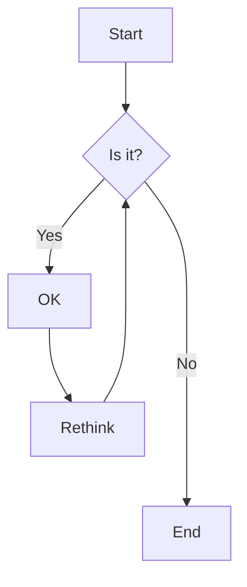
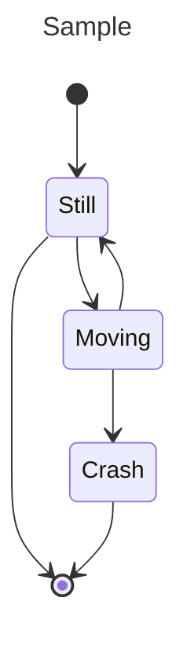

# mermaid.js examples

## Pie chart

```mermaid
pie title Pets adopted by volunteers
    "Dogs" : 386
    "Cats" : 85
```

## Flowchart

```mermaid
flowchart TD
    A[Start] --> B{Is it?}
    B -- Yes --> C[OK]
    C --> D[Rethink]
    D --> B
    B -- No ----> E[End]
```   

## State Diagram

```mermaid
---
title: Sample
---
stateDiagram-v2
    [*] --> Still
    Still --> [*]

    Still --> Moving
    Moving --> Still
    Moving --> Crash
    Crash --> [*]
```
